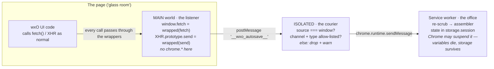
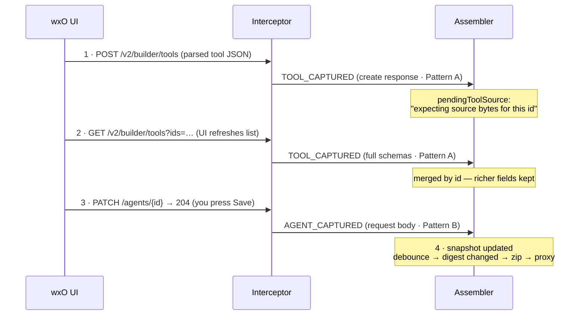

# The Capture Layer

> **wxO Agent Builder Autosave · deep dive**
>
> A closer look at the two ideas the whole extension rests on: the three places code runs inside a Chrome tab, and exactly what the extension reads off the wire — starting simple, then all the way down.

---

## Part 1 · The three execution contexts

> **The plain version**
>
> Picture the wxO builder page as a **sealed glass room**. Inside, the page's JavaScript is having a constant conversation with IBM's servers — "give me this agent", "save these changes", "here's a file". The extension wants to overhear that conversation, but Chrome deliberately keeps extensions outside the glass.
>
> So the extension splits itself into three people. One (**the listener**) sneaks *inside* the room — it can hear everything, but inside the room it has no phone, so it can't call home. One (**the courier**) stands just outside the glass — it can't hear anything inside, but it has a phone. The listener writes what it hears on notes and presses them against the glass; the courier reads each note, checks it looks legitimate, and phones it in. The third (**the office**) sits far away in the back of the browser, takes those calls, and does all the real work: assembling snapshots, building zips, talking to your storage.

Now the same picture with its real names. Chrome runs extension code in three separate JavaScript contexts, and each one can do things the others can't:

| | MAIN world (the listener) | ISOLATED world (the courier) | Service worker (the office) |
|---|---|---|---|
| File | `content/index.ts` | `content/bridge.ts` | `background/*.ts` |
| Sees the page's `fetch`/XHR | **Yes — same globals as the page** | No — own separate copies | No — no page access at all |
| Can use `chrome.*` APIs | No | Partially (`chrome.runtime`) | **Yes — storage, webRequest, fetch to proxy** |
| Lifetime | Per page load | Per page load | Independent; Chrome may suspend it when idle |
| Talks to the next one via | `window.postMessage` | `chrome.runtime.sendMessage` | — |

### Why the listener must be in the MAIN world

The whole trick is *monkey-patching*: replacing `window.fetch` and `XMLHttpRequest.prototype.open/send` with wrapper functions that behave identically but take notes. The catch is that Chrome gives the ISOLATED world its **own copies** of every global. Patch `fetch` there and you've patched a copy the page never touches — the wxO UI keeps calling the original, and you hear nothing. Only code injected into the MAIN world shares the page's actual globals, so only there does the patch intercept real traffic.

Two hard constraints follow from living inside the glass room, and both shaped the code:

- **No `chrome.*` APIs.** The MAIN world is the page's territory; Chrome doesn't expose extension APIs there. Hence the courier: captures leave the room as `window.postMessage` notes on a named channel, `__wxo_autosave__`.
- **No module imports, and it must run at `document_start`.** The patch has to be installed *before the page's first request fires*, or early traffic escapes unobserved. The bundler's module loader for content scripts breaks that timing guarantee, so both content scripts are single files with everything inlined.

### Why the courier checks the notes

`window.postMessage` is a public bulletin board — any script on the page (including IBM's own analytics, or an embedded iframe) could post to it. The bridge therefore trusts nothing: it accepts a message only if it came from this exact window (`event.source === window`), carries the channel marker, and has one of eight allow-listed event types. Anything else is dropped with a warning. Only validated messages are relayed onward with `chrome.runtime.sendMessage`.

### Why the office keeps its state in storage

Manifest V3 service workers are not long-lived processes — Chrome suspends them after ~30 seconds of inactivity and restarts them on the next message. Any state held in a plain variable silently vanishes between events. That's why the assembler keeps snapshots-in-progress and its pairing buffers in `chrome.storage.session`, and only the CSRF token — which is deliberately ephemeral — lives in memory.

*The relay in full. Each hop exists because of a Chrome restriction: the listener can hear but not phone; the courier can phone but not hear; the office can act but can't be in the room.*

## Part 2 · What actually gets captured

> **The plain version**
>
> The extension never asks IBM for anything. It only reads mail that's *already being delivered* — the requests the builder page sends and the answers that come back while you work. The skill is knowing **which envelopes are worth opening, and which side of the exchange holds the information**.
>
> Usually the interesting part is the *answer* (you open an agent, the server sends its full definition back — read that). Sometimes the interesting part is the *question* (you click Save, the browser sends the new state up and the server just replies "OK, 204, no content" — so the outgoing request is the only place the saved state exists). And sometimes it's an *attachment* (you upload a PDF — the bytes are in the outgoing envelope, and they'll never come back down again).

Those three cases — plus one bit of passive observation — are the complete capture surface. Everything the extension knows arrives through one of these four patterns:

### Pattern A — read the response (server → browser)

For plain reads, the response body has everything. The wrapper lets the real `fetch` run, then calls `response.clone().json()` — cloning matters, because a body stream can only be consumed once, and the original must go to the page untouched. Endpoints handled this way:

- **Agent detail** — `GET /v1/builder/orchestrate/agents/{id}`. The richest single capture: the response includes `toolsSelected[]` with complete binding objects for every attached tool.
- **Tools** — `GET /v2/builder/tools?ids=…`. Full tool records: `input_schema`, `output_schema`, `binding`, `display_name`. The builder fires this every time it shows a tool list, so tools get (re)captured constantly.
- **Connections catalog** — `GET /v1/orchestrate/connections/applications`. The whole tenant list; scrubbed to `app_id`/`kind`/`server_url` on the spot, batched into one event.
- **Knowledge-base detail** — `GET /v1/orchestrate/knowledge-bases/{id}`.

### Pattern B — read the request (browser → server), because the response is empty

When you press Save on an agent, the UI sends `PATCH /v1/builder/orchestrate/agents/{id}` with the full new state in the request body — and the server answers `204 No Content`. Nothing comes back down. So the wrapper clones the *request*, waits for the response, and only if it was a 2xx forwards the request body as the captured agent state. Waiting for the 2xx is the difference between recording what was *saved* and recording what was merely *attempted* — a rejected save is ignored.

### Pattern C — read the attachment (file uploads)

Three endpoints carry files the server never echoes back: KB create (`POST …/knowledge-bases/documents` — config JSON + first document in one multipart form), KB add-documents (`PUT …/{id}/documents`), and hand-crafted tool upload (`POST /v2/builder/tools`). The wxO UI sends these as `FormData` via axios/XHR, so the XHR wrapper walks the form's entries, reads each `File`'s bytes with `arrayBuffer()`, and forwards filename + content-type + bytes after the 2xx. Two wrinkles:

- **KB create doesn't know its own id yet.** The KB's uuid is assigned by the server and only appears in the 201 response — so the file capture is deferred until the response arrives, then attached to that uuid.
- **A belt-and-braces second tap.** The service worker also registers `chrome.webRequest.onBeforeRequest` for the same three URLs and parses raw multipart bytes when Chrome provides them. Either path may fire; the assembler de-duplicates files by filename + length, so double observation is harmless.

> ⚠️ **The one that got away — and the workaround.** The current builder UI parses OpenAPI uploads *client-side* and sends extracted JSON, so for those tools no file ever crosses the network and Pattern C never fires. The fix leans on Pattern A instead: the tools GET carries the full schemas, and the zip builder reconstructs an importable `spec.yaml` from them. Captured bytes still win when they exist. Catalog tools are the harder case — their source goes straight to S3 via a presigned URL and never touches this API at all.

### Pattern D — observe, don't capture

Two ambient signals are noted in passing: the `x-ibm-wo-csrf` request header (kept only in service-worker memory, for potential proactive reads with the user's own session) and a tenant id from the `x-ibm-wo-tenant-id` cookie, used to namespace snapshot storage. Neither is a credential and neither is written to disk.

### A worked example: you upload an OpenAPI tool

Here is a real save, end to end, showing which pattern fires at each step and how out-of-order events get stitched together:

*One tool upload, three captures, one snapshot. If a real file **had** crossed the wire (a Python upload), a fourth event — TOOL_FILE_CAPTURED — would arrive in unguaranteed order relative to step 1, and the pending buffer pairs them: whichever side lands first waits for the other.*

### Why capture feels "spread out"

Notice that no single request contains the whole agent. The agent definition arrives via Pattern B on save, its tools via Pattern A whenever a list renders, its KB documents via Pattern C at upload time — possibly minutes or days apart, across different page loads. That's the assembler's whole job: each event upserts into the per-agent snapshot in `chrome.storage.session`, merging by id so richer captures are never overwritten by thinner ones, pruning tools the agent no longer references, and keeping only the connections its tools actually bind. The snapshot at any moment is the union of everything observed so far — which is also why the extension only fully covers what the UI has *touched* while it was installed.

## The scrub, precisely

Captured payloads pass through scrubbing twice. In the MAIN world, connection records are reduced by allowlist — only `app_id`, `kind`, `server_url` survive; every other key (tokens, client secrets, auth blocks) is simply never copied. In the service worker, a second full scrubber sweeps *all* payload types for secret-shaped fields as defence-in-depth, before anything reaches storage or a zip. The design principle: the dangerous data is dropped at the earliest possible moment, and nothing downstream ever has to remember to remove it.
