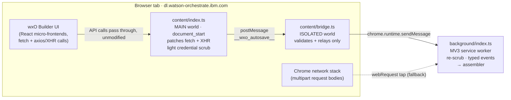
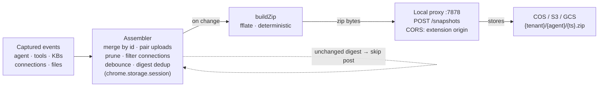
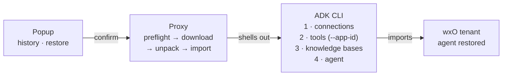

# Autosave Extension Internals

> **wxO Agent Builder Autosave · engineering reference**
>
> How the Chrome extension passively captures watsonx Orchestrate Agent Builder state from inside the browser, assembles it into versioned snapshot zips, and hands them to a local proxy for storage and one-click ADK restore.

---

## The problem it solves

The wxO Agent Builder UI has no version history. A builder who mis-saves, deletes a tool, or loses an agent has nothing to roll back to unless they were running ADK CLI exports by hand alongside every session. The extension is a passive safety net: it never sends its own requests to wxO and never modifies the page — it only observes the API traffic the builder UI is already making, reconstructs the agent's state from it, and saves a restorable zip every time that state changes.

## Three execution contexts

Chrome extensions can't simply "watch a page's network traffic" from one place. The page's own JavaScript, the extension's content scripts, and the extension's background service worker run in three separate contexts with different capabilities, and the design follows directly from those constraints:

- **MAIN world** (the page's own context) — the only place where patching `window.fetch` and `XMLHttpRequest.prototype` affects the wxO UI's requests, because the ISOLATED world gets its *own copies* of those globals. The cost: no `chrome.*` APIs and no module imports here.
- **ISOLATED world** (normal content-script context) — has `chrome.runtime`, but can't see the page's fetches. It exists purely as a relay.
- **Service worker** (background) — has storage, `chrome.webRequest`, and cross-origin fetch to the proxy, but no access to the page at all.



*Capture path. The MAIN-world interceptor is the primary source; `chrome.webRequest.onBeforeRequest` is a complementary tap for multipart upload bodies. Nothing in this path alters a request or response.*

### Why the bridge exists

The MAIN-world script can't call `chrome.runtime.sendMessage`, so it posts each capture to `window` on the `__wxo_autosave__` channel. The bridge (ISOLATED, same page, same `document_start` timing) accepts a message only if it comes from the same window, carries the channel marker, and has one of eight allow-listed types — then relays it to the service worker. Both content scripts are import-free by design: the bundler's module loader for content scripts would break the `document_start` guarantee that lets the interceptor patch `fetch` before the page's first request.

## What gets captured

The interceptor matches wxO builder API URLs (`/mfe_builder/api/v1|v2/…`) and captures two kinds of traffic — *response* bodies for reads, and *request* bodies where the response is empty or the payload is a file upload:

| Endpoint | Direction | Event | Why |
|---|---|---|---|
| `GET /v1/builder/orchestrate/agents/{id}` | response | AGENT_CAPTURED | Richest single source — includes `toolsSelected[]` with full bindings |
| `PATCH /v1/builder/orchestrate/agents/{id}` | request | AGENT_CAPTURED | Response is 204; the request body is the saved state |
| `GET /v2/builder/tools?ids=…` | response | TOOL_CAPTURED | Full tool records: schemas, binding, display name |
| `POST /v2/builder/tools` (multipart) | request | TOOL_FILE_CAPTURED | Hand-uploaded Python / OpenAPI source bytes |
| `GET /v1/orchestrate/connections/applications` | response | CONNECTION_BATCH_CAPTURED | Tenant connection catalog (metadata only) |
| `GET /v1/orchestrate/knowledge-bases/{id}` | response | KB_META_CAPTURED | KB configuration |
| `POST …/knowledge-bases/documents` | request | KB_FILE_CAPTURED | KB create + first document (uuid from 201 response) |
| `PUT …/knowledge-bases/{id}/documents` | request | KB_FILE_CAPTURED | Additional document uploads |

One header is also observed: `x-ibm-wo-csrf`, the token the wxO UI itself uses. It lives only in service-worker memory (never storage) and exists so the assembler could make proactive reads with the user's own session. A tenant hint is read from the `x-ibm-wo-tenant-id` cookie — an opaque id, not a credential.

> ⚠️ **Credentials never travel.** Connection records are scrubbed in the MAIN world with an allowlist — only `app_id`, `kind`, and `server_url` survive — and the service worker re-applies a full scrubber as defence-in-depth. Secrets, API keys, and OAuth material are dropped before anything leaves the page context. After a restore, connections must be re-credentialed by hand; the popup's preflight checklist lists exactly which ones.

## The assembler: events → snapshot

The service worker's assembler (`background/assembler.ts`) coalesces the event stream into one *snapshot per agent*, held in `chrome.storage.session`. All handlers run through a promise queue, so concurrent captures can't interleave mid-write. The interesting mechanics:

- **Merging, not replacing.** Tools arrive from several sources (agent detail's `toolsSelected`, the paginated tools GET, a create response). `upsertById` spread-merges by id, so a later thin capture never erases fields a richer one already provided.
- **Upload pairing.** A tool upload produces two events in unguaranteed order: the file bytes (read async from FormData) and the create response. A `pendingToolSource` buffer in session storage pairs them — whichever arrives first waits for the other. KB files have an equivalent pending buffer keyed by KB id.
- **Scoping.** A tool belongs to a snapshot only if the agent references it; tools no longer referenced are pruned on the next agent save. The 200-odd tenant connections are filtered down to just the ones the agent's tools actually bind.
- **Debounce + dedup.** Snapshot writes are debounced, and a content digest of the would-be zip is compared against the last posted one — an unchanged snapshot logs `snapshot unchanged — skipping post` instead of re-uploading.

## The snapshot zip

Snapshots serialise with `fflate` into a deterministic zip (fixed mtimes, so identical state → identical bytes). The layout mirrors what the ADK CLI can re-import:

```text
manifest.json                    schemaVersion · capturedAt · tenant · agent id/name
agent/
  agent.yaml                     agent definition (JSON-encoded — valid YAML 1.2)
tools/{tool-name}/
  tool.json                      full builder record: schemas, binding, flags
  source.py | spec.yaml          captured upload bytes, or a synthesized spec
  requirements.txt               if a Python tool declared dependencies
knowledge_bases/{kb-id}/
  kb.yaml                        KB configuration
  documents/{filename}           original uploaded documents, byte-for-byte
connections/{app_id}.yaml        metadata only — never credentials
```

> ℹ️ **Spec synthesis.** The current builder UI parses OpenAPI uploads client-side and POSTs extracted JSON — the raw spec file never crosses the network, so there is nothing to intercept. For OpenAPI-bound tools with no captured source, `openapiSynth.ts` reverses the parse: it rebuilds an importable OpenAPI 3.0 document from `binding.openapi` + `input_schema`/`output_schema`, recovering real wire parameter names from each property's `aliasName`. Captured bytes always take precedence when they exist.

## End-to-end pipeline



*Save path. The proxy is optional at capture time — if it's offline the extension logs a warning and keeps the latest snapshot locally; nothing crashes. A recent-snapshot index in `chrome.storage.local` feeds the popup's history list.*

## Restore

Restore runs through the popup and the proxy — never through the extension writing to wxO directly. The proxy machine must have the ADK CLI installed and an environment activated (`orchestrate env activate`); the proxy validates this at startup.



*Restore path. The dependency order matters: tools can't import before the connections they bind exist, and the agent definition references everything else, so it goes last. The preflight report lists connections needing re-credentialing and tools whose source was unavailable, before anything runs.*

## Security posture

- **Passive by construction.** The interceptor forwards every request untouched and captures only after a 2xx response — rejected saves are ignored.
- **Scrubbing at two layers.** Allowlist scrub in the MAIN world, full scrubber again in the service worker before storage.
- **Ephemeral tokens.** The CSRF token is held in service-worker memory only; a worker restart forgets it.
- **Locked-down proxy.** CORS restricted to the extension's own `chrome-extension://` origin; requests with *no* Origin header are rejected (403) so curl/scripts can't reach `POST /restore`, which shells out to a CLI. The single exception is `GET /health`.
- **Scoped host permissions.** The manifest matches only the two wxO SaaS hostname families (`*.watson-orchestrate.cloud.ibm.com`, `*.watson-orchestrate.ibm.com`) plus localhost for the proxy.

## Known limits

| Limit | Why | Effect |
|---|---|---|
| Catalog tools have no source | Created from a presigned S3 URL; source never touches the builder API | Metadata + binding only; flagged in preflight |
| MCP toolkits not restorable from capture | Server definition lives outside the captured surface | Metadata only |
| Connections restore without secrets | Deliberate — credentials are never captured | Re-credential by hand after restore |
| CLI-imported Python tools | ADK import bypasses the browser entirely | Source not captured unless later re-uploaded via UI |
| Capture requires an open builder tab | Everything derives from observed UI traffic | No headless / scheduled backup |

## Source map

| File | Role |
|---|---|
| `src/content/index.ts` | MAIN-world fetch/XHR interceptor, endpoint matchers, light scrub |
| `src/content/bridge.ts` | ISOLATED-world validator/relay (import-free) |
| `src/background/index.ts` | Message dispatch, typed event bus, webRequest multipart tap, token holder |
| `src/background/assembler.ts` | Snapshot state machine: merge, pair, prune, debounce, digest, proxy POST |
| `src/shared/capture.ts` | Pure extraction helpers (tools, tenant, agent ids) |
| `src/shared/openapiSynth.ts` | OpenAPI spec reconstruction for tools with no captured source |
| `src/shared/zip.ts` | Deterministic zip build/parse, content digest |
| `src/shared/scrubber.ts` | Credential scrubbing |
| `src/popup/popup.ts` | History, settings, restore flow with preflight |
| `wxo-autosave-proxy/` | Node proxy: storage adapters (COS/S3/GCS), restore via ADK CLI |
